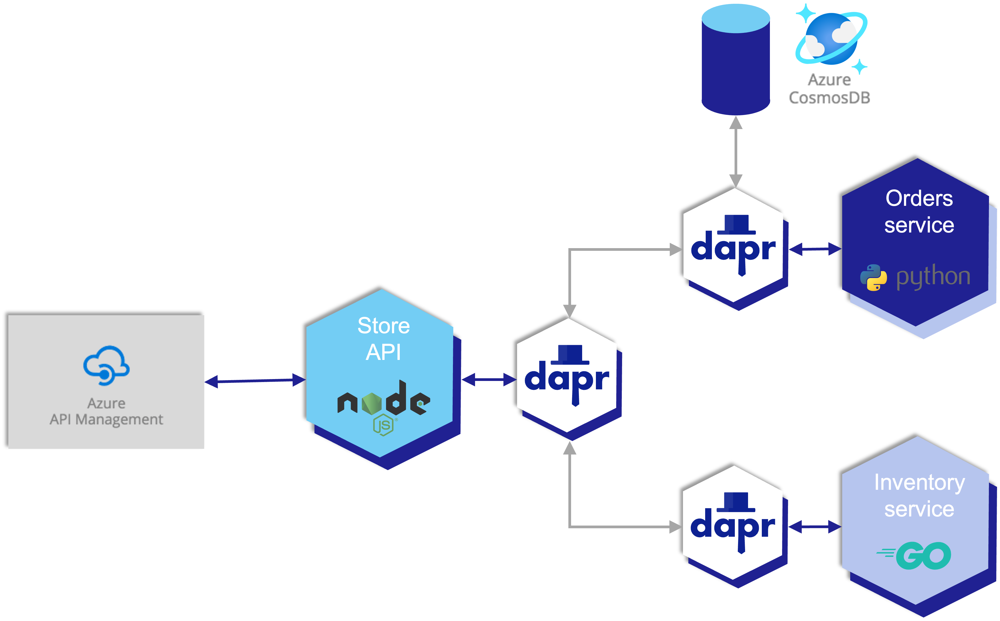

# Container App Store Microservice Sample

This is a sample microservice solution for Azure Container Apps.  It will create a store microservice which will need to call into an order service and an inventory service.  Dapr is used to secure communication and calls between services, and Azure API Management and Azure Cosmos DB are created alongside the microservices.

The entire solution is configured with [GitHub Actions](https://github.com/features/actions) and [Bicep](https://docs.microsoft.com/azure/azure-resource-manager/bicep/overview) for CI/CD.

IMPORTANT: In general, each microservice should have an independent release and deployment. For the sake of this sample we are building and deploying as part of a single repo.  

- [Deploy](#deploy)
- [Solution Overview](#solution-overview)
- [Build and run](#build-and-run)


### Github Actions Secrets

## Deploy

1. Fork the sample repo
2. Create the following required [encrypted secrets](https://docs.github.com/en/actions/security-guides/encrypted-secrets#creating-encrypted-secrets-for-an-environment) for the sample

  | Name | Value |
  | ---- | ----- |
  | AZURE_CREDENTIALS | The JSON credentials for an Azure subscription. [Learn more](https://docs.microsoft.com/azure/developer/github/connect-from-azure?tabs=azure-portal%2Cwindows#create-a-service-principal-and-add-it-as-a-github-secret) |
  | RESOURCE_GROUP | The name of the resource group to create |
  | PACKAGES_TOKEN | A GitHub personal access token with the `packages:read` scope. [Learn more](https://docs.github.com/en/authentication/keeping-your-account-and-data-secure/creating-a-personal-access-token) |

3. Open the GitHub Actions, select the **Build and Deploy** action and choose to run the workflow.  
  
    This will start the GitHub Actions which will build the code, publish them to your GitHub repository as private container images, create an Azure Container App environment, a Cosmos DB database, and Container Apps for each of the microservices.
4. Once the GitHub Actions have completed successfully, navigate to the [Azure Portal](https://portal.azure.com) and select the resource group you created.  Open the `node-app` container, and browse to the URL.  You should see the sample application running.  You can navigate to the `/orders?id=foo` endpoint and `/inventory?id=foo` to test the microservices.

## Solution Overview

  

There are three main microservices in the solution.  

#### Store API (`node-service`)
The [`node-service`](./node-service) is an express.js API that exposes three endpoints.  `/` will return the primary index page, `/order` will return details on an order (retrieved from the **order service**), and `/inventory` will return details on an inventory item (retrieved from the **inventory service**).

#### Order Service (`python-service`)
The [`python-service`](./python-service) is a Python flask app that will retrieve and store the state of orders.  It uses [Dapr state management](https://docs.dapr.io/developing-applications/building-blocks/state-management/state-management-overview/) to store the state of the orders.  When deployed in Container Apps, Dapr is configured to point to an Azure Cosmos DB to back the state. 

#### Inventory Service (`go-service`)
The ['go-service'](./go-service) is a Go mux app that will retrieve and store the state of inventory.  For this sample, the mux app just returns back a static value.

## Build and Run

- [Option 1: Build and run with GitHub Codespaces (recommended)](#option-1-build-and-run-with-github-codespaces-recommended)
- [Option 2: Build and run with VS Code Remote Containers](#option-2-build-and-run-with-vs-code-remote-containers)
- [Option 3: Build and run manually](#option-3-build-and-run-manually)

### Option 1: Build and run with GitHub Codespaces (recommended)

#### Pre-requisites
- A GitHub account with access to [GitHub Codespaces](https://github.com/features/codespaces)


### Option 2: Build and run with VS Code Remote Containers

#### Pre-requisites
- Docker
- VS Code with the [remote containers](https://marketplace.visualstudio.com/items?itemName=ms-vscode-remote.remote-containers) extension installed

### Option 3: Build and run manually

#### Pre-requisites

The following is needed to run this sample:
- [Docker Desktop](https://www.docker.com/get-started)
- [Node.js](https://nodejs.org/en/download/)
- [Python 3.x](https://www.python.org/downloads/)
- [Go](https://golang.org/doc/install)
- [Dapr](https://docs.dapr.io/getting-started/install-dapr-cli/)
- [Azure CLI](https://docs.microsoft.com/en-us/cli/azure/install-azure-cli-windows?tabs=azure-cli)
- [Azure Container Apps CLI extension](https://github.com/microsoft/azure-container-apps)

#### Steps

1. Fork the sample repo
2. Clone the repo: `git clone https://github.com/{username}/container-app-demo`
3. Build the sample: 
```bash
cd assets
./init.sh
```
4. Run the sample
##### Local run and debug

Dapr will be used to start microservices and enable APIs for things like service discovery, state management, and observability.  The code for `store-api` service invokes other services at the localhost:daprport host address, and sets the `dapr-app-id` HTTP header to enable service discovery using an HTTP proxy feature. 

Run the `node-service` (store-api) service in a new terminal window:
```bash
dapr run --app-id node-service --app-port 8080 --dapr-http-port 3600 --components-path ./components -- node app.js
```

Run the `python-service` (order) service in a new terminal window:
```bash
dapr run --app-id python-service --app-port 5000 --dapr-http-port 3500 --components-path . -- python3 app.py
```

Run the `go-service` (inventory) service in a new terminal window:
```bash
dapr run --app-id go-service --app-port 8050 -- go run .
```

`State reliability`: orders app is configured to bind the Dapr State Store APIs to a local instance of Redis that is preinstalled with Dapr.  When the application is later deployed to Azure Container Apps, the component config yaml will be modified to point to an Azure CosmosDb instance.  No code changes will be needed since the Dapr State Store API is completely portable.  

`Observability`: distributed tracing is enabled by default on (http://localhost:9411/).  Browse to this URL to inspect any distributed trace or to inspect dependencies in real time.  When the application is deployed to Azure we recommend modifying the component config YAML to enable [Open Telemetry and Application Insights](https://docs.dapr.io/operations/monitoring/tracing/open-telemetry-collector-appinsights/). 

##### Local run and debug easily using Tye (optional)

Tye is a new tool that makes it easy to run multiple microservices, observe in a dashboard, and tail the logs.  This is an alternative to manually doing the three `dapr run` commands above.  This step requires a pre-requistite install of Tye from (https://aka.ms/tye). 

To run all services using Tye simply:
```bash
tye run
```

Once the microservices are started by Tye you can observe in the Tye dashboard.  The Tye dashboard will be listed in the standard output, and typically this is available at (http://localhost:8000). In the dashboard you can view each microservice, endpoint, and view Logs.